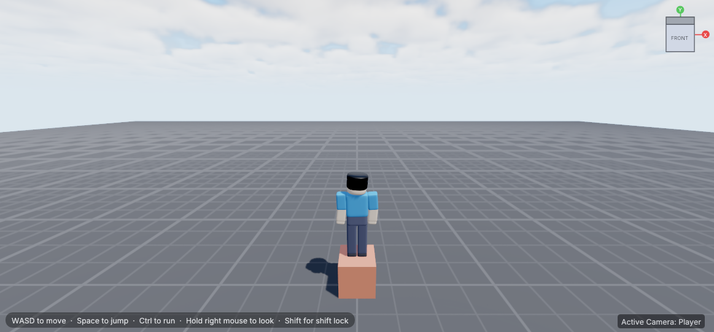
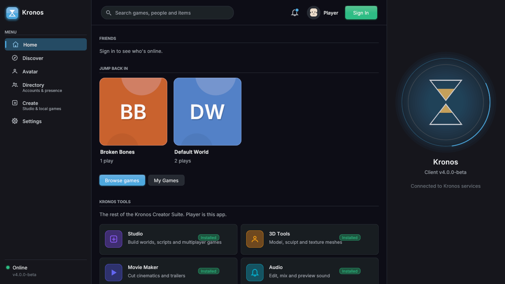
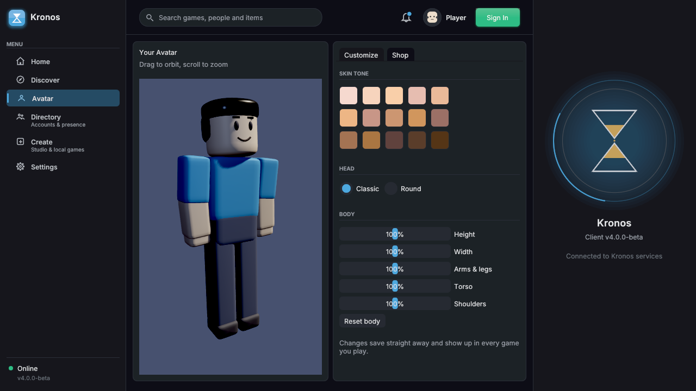
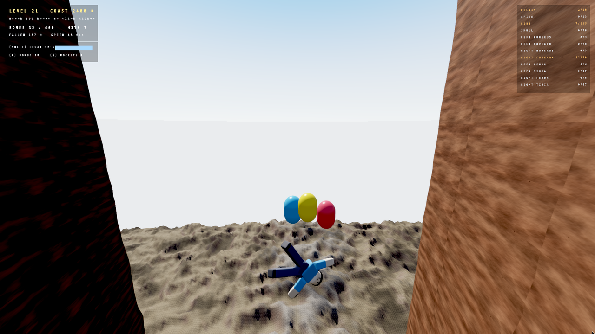

# Kronos

**Make games and play them, on a game engine built from scratch.**

Kronos is a game platform like Roblox, with a fresh coat of paint: a
**Player** for playing games and dressing up your avatar, and **Kronos
Studio** for building your own games with parts, Luau scripts, physics
and sound. Under the hood it's a C++ engine with a Vulkan renderer, Jolt
Physics and Luau scripting. There's no third-party engine underneath.

New in **4.3**: Kronos speaks Roblox. Import a Roblox place (`.rbxl`,
`.rbxm`, `.rbxlx` or `.rbxmx`) into Studio and its scripts run, using the
same `game`, `workspace`, `Instance.new`, events, Players, Humanoids,
RemoteEvents, DataStores, TweenService and GUI you already know.

> Kronos **4.3** is a **pre-beta**. Expect rough edges, and please
> [report anything that breaks](https://github.com/Bands-yt/kronos-platform/issues/new/choose).



| The Player | Your avatar | Broken Bones |
|---|---|---|
|  |  |  |

## Get it

Download the latest release from the
[Releases page](https://github.com/Bands-yt/kronos-platform/releases):

| Your computer | Download | Then |
|---|---|---|
| Windows 10/11 | `KronosSetup.exe` | Run it, then open **Kronos Player** or **Kronos Studio** from the Start menu |
| Windows (no installer) | `kronos-<version>-windows-x64.zip` | Unzip it and run `engine_runtime.exe` (Player) or `studio.exe` (Studio). Keep the folder together |
| Linux | `kronos-<version>-linux-x64.tar.gz` | Extract it and run `./engine_runtime` (Player) or `./studio` (Studio) |

You need a graphics card with **Vulkan** support. Almost every card from
the last ten years has it; update your graphics driver if Kronos won't
start. If Windows says `VCRUNTIME140.dll was not found`, install the
[Microsoft Visual C++ Redistributable](https://aka.ms/vs/17/release/vc_redist.x64.exe).

## Your first game in five minutes

1. Open **Kronos Studio**. A starter world opens with a ground and a box.
2. Click **Part** (Home tab) to add blocks. Drag the arrows to move them;
   **Scale** and **Rotate** are next to Move.
3. Name one part `SpawnLocation` in the Inspector. That's where players
   appear.
4. Press **Play**. Your avatar drops into the world. Walk around, jump on
   your parts, then press **Stop** and keep building.
5. Press **Ctrl+S** and give your game a name. It now shows up in the
   Player under **Create → My Games**, ready to play.

Want things to move? Select a part, open the **Script Editor** and write
some Luau. The [Lua API](docs/LUA_API.md) lists everything scripts can do.

## Bring a Roblox game

1. In Roblox Studio, save your place (File → Save to File). The usual
   `.rbxl` file is fine.
2. In Kronos Studio, open **File → Import Roblox file**, paste the file's
   path and press **Import**. The report shows how much of the place
   Kronos understands, as a score.
3. Press **Spawn Into Scene**, then **Play**. Scripts start like they do
   in Roblox: Scripts on the server side, LocalScripts for the player.

What works today, and what doesn't yet:
[docs/ROBLOX_BRIDGE.md](docs/ROBLOX_BRIDGE.md). The command-line tool
`kronos_compat` gives the same score for a whole folder of places. Only
import places you made or have permission to use.

## Controls

| Input | What it does |
|---|---|
| WASD | Move |
| Space | Jump |
| Left Ctrl (hold) | Run |
| Right mouse (hold) and drag | Look around |
| Mouse wheel | Zoom |
| Shift | Shift lock: the character faces where you look |
| `/` or the chat button | Open chat (Player) |
| Escape | Pause menu (Player) |

In Studio, hold the right mouse button and use WASD to fly the editor
camera, and scroll to zoom.

## Found a bug? Have an idea?

- [Report a bug](https://github.com/Bands-yt/kronos-platform/issues/new?template=bug_report.yml).
  If Kronos crashed, attach the `crash_report_<date>.txt` file from the
  folder it ran in.
- [Suggest an idea](https://github.com/Bands-yt/kronos-platform/issues/new?template=idea.yml).

## Build it yourself

**Requirements:** CMake ≥ 3.24, a C++20 compiler, Ninja, SDL2, a Vulkan
loader and driver, and `glslc` on `PATH`. Details and troubleshooting:
[docs/QUICKSTART.md](docs/QUICKSTART.md).

```sh
git clone https://github.com/Bands-yt/kronos-platform.git
cd kronos-platform/engine
cmake -S . -B build -G Ninja -DCMAKE_BUILD_TYPE=RelWithDebInfo
cmake --build build -j$(nproc)
./build/src/engine_runtime   # the Player
./build/src/kronos_studio    # Kronos Studio
```

The first build downloads and compiles every dependency (Luau and Jolt
are the biggest), so it takes a few minutes.

## Learn more

| I want to... | Read |
|---|---|
| Build and run from source | [docs/QUICKSTART.md](docs/QUICKSTART.md) |
| Fix a problem starting Kronos | [docs/TROUBLESHOOTING.md](docs/TROUBLESHOOTING.md) |
| Script my game | [docs/LUA_CREATOR_EXPERIENCE.md](docs/LUA_CREATOR_EXPERIENCE.md), [docs/LUA_API.md](docs/LUA_API.md) |
| Import a Roblox game, or see which Roblox APIs work | [docs/ROBLOX_BRIDGE.md](docs/ROBLOX_BRIDGE.md) |
| Add music and sound | [docs/AUDIO_MIXER.md](docs/AUDIO_MIXER.md) |
| Set up chat moderation (Gemini) | [docs/CHAT_MODERATION.md](docs/CHAT_MODERATION.md) |
| Write a Studio plugin | [docs/PLUGIN_API.md](docs/PLUGIN_API.md) |
| Build a launcher or tool for Kronos | [docs/THIRD_PARTY_TOOLS.md](docs/THIRD_PARTY_TOOLS.md) |
| See what's coming next | [docs/ROADMAP.md](docs/ROADMAP.md) |
| Understand how the engine fits together | [docs/ARCHITECTURE.md](docs/ARCHITECTURE.md) |

## License

- **The plugin kit is open source** under the
  [Apache License 2.0](LICENSES/Apache-2.0.txt): the C plugin API, the
  example plugins, the Luau plugin template, the script type definitions
  and the plugin and script API docs. Build anything with them, including
  paid or closed-source tools. The full list is in
  [LICENSING.md](LICENSING.md).
- **Launchers, wrappers and other tools for Kronos are welcome.**
  [docs/THIRD_PARTY_TOOLS.md](docs/THIRD_PARTY_TOOLS.md) explains what's
  allowed and lists the launch options you can rely on.
- **Everything else is all rights reserved** (see [LICENSE](LICENSE)): the
  engine, Player, Studio and backend source is public to read, but copying,
  changing or reusing it needs written permission.

## Repository layout

```
engine/      engine, Player and Studio source, build and tests
docs/        documentation (see "Learn more" above)
games/       example games shown in the Player
templates/   the starter project and a starter plugin
examples/    example Luau scripts
installer/   Windows installer
scripts/     packaging and helper scripts
```
