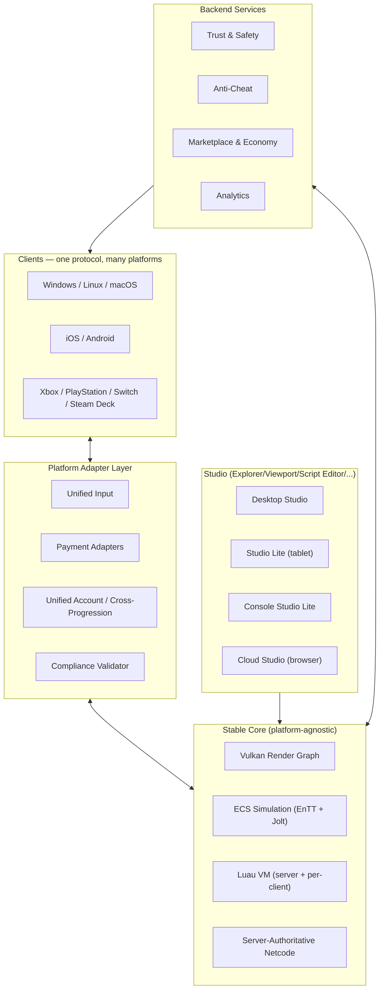
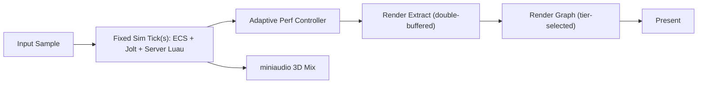
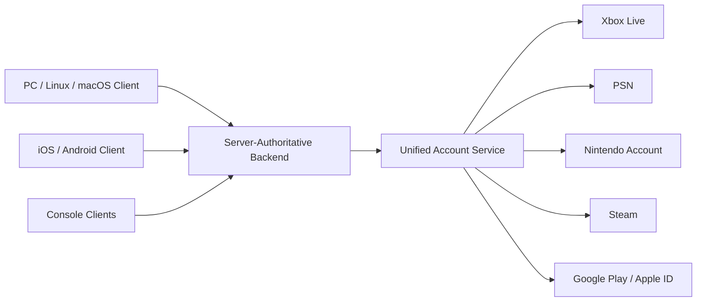
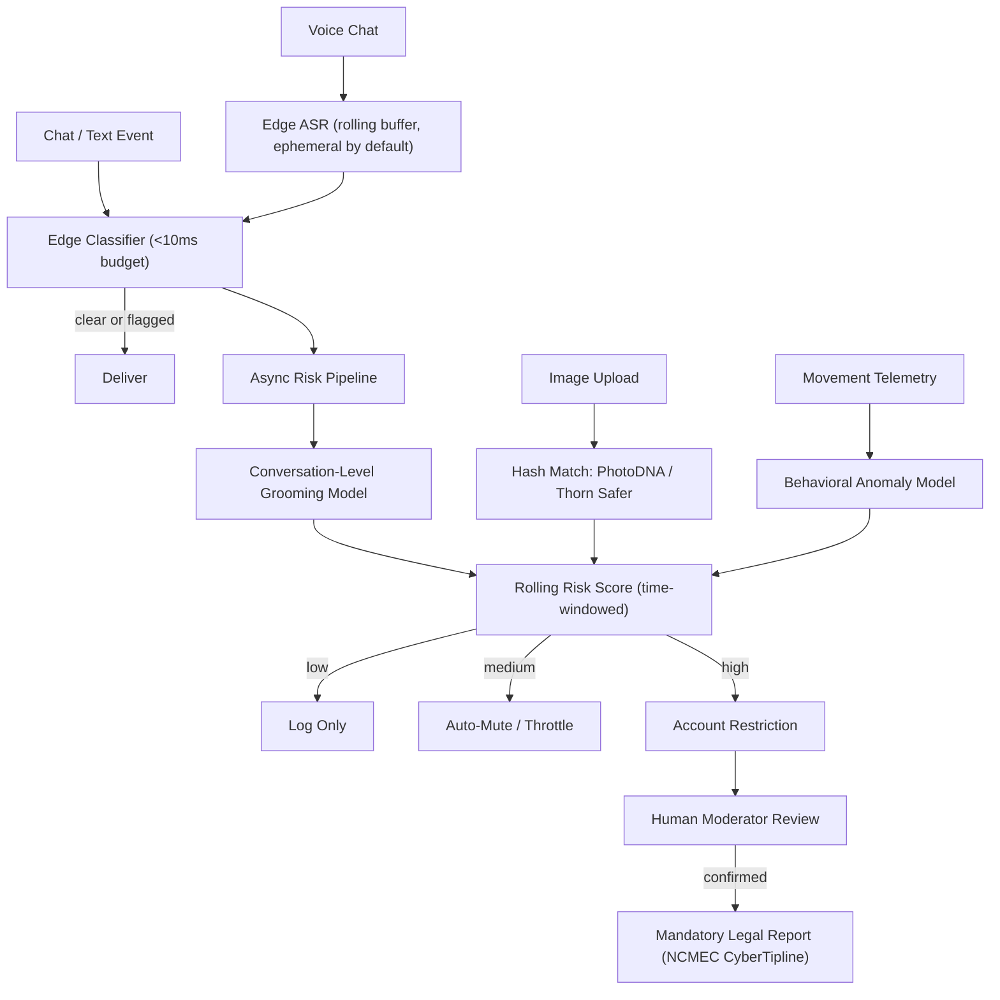

# Unified Architecture — Roblox-Style UGC Platform

Status: draft v0.2 — 2026-08-01
Scope: Engine Runtime, Studio IDE, Scripting Layer, Migration Layer, Cross-Platform Systems, Marketplace & Economy, AI Moderation & Safety, Anti-Cheat, Accessibility, Analytics

Supersedes v0.1. Everything in v0.1 is preserved and extended below; nothing that shipped there was rolled back.

---

## 1. Design Principles

Six rules govern every decision below. Where a later section seems to contradict one of these, the principle wins.

1. **Roblox parity is a hard constraint, not a goal.** Does an existing script, model, or plugin run with zero or near-zero changes? This is why the single most important decision in this document is embedding **Luau** — Roblox's actual, open-sourced Lua 5.1 fork — rather than writing a "Lua 5.1-compatible" VM from scratch.
2. **New capability is additive, never load-bearing.** DLSS, ray tracing, schema-validated remotes, streaming replication, adaptive triggers, gyro aiming, kernel-level anti-cheat — all opt-in, all capability-gated, all defaulting to the behavior a ported project already expects.
3. **Server-authoritative, always.** No non-authoritative mode exists, on any platform. This is also the foundation of anti-cheat (§11) — a client that cannot lie about world state can only lie about input.
4. **What you see in Studio is what ships.** One render graph, shared by the editor viewport, the runtime game view, and — new in this revision — Studio Lite and Cloud Studio. Same rule, extended: what a creator sees on a tablet or in a browser must be the same simulation, not an approximation.
5. **Trust & Safety is a dependency, not a phase.** Any feature letting one user's content — text, voice, image, or behavior — reach another user does not ship without its moderation hook wired in first.
6. **Platform differences are isolated at the edges, never in the core.** The ECS, the render graph, the Luau VM, and the netcode do not know or care which store, controller, or screen size they're running under. Everything platform-specific — input mapping, payment processing, certification quirks, safe-zone insets — lives in adapter layers around that stable core. This is what makes cross-play, cross-progression, and "zero-loss migration" survive contact with five more platforms without becoming five more codebases.

---

## 2. System Overview



The core is deliberately boring: it is the same ECS, render graph, Luau VM, and netcode described in v0.1, unmodified. Everything new in this revision — five platforms, a marketplace, moderation for voice, anti-cheat, accessibility, analytics — is built as adapters and services around that core, per Principle 6. That is the only way this scope stays maintainable.

---

## 3. Tech Stack (additions since v0.1)

| Layer | Choice | Why |
|---|---|---|
| Cross-platform build | CMake toolchains per target (MSVC/Clang/GCC), console SDKs behind a thin platform-abstraction target (compiled only inside each platform holder's NDA'd environment) | Keeps the console SDKs out of the open core repo entirely — required by every platform holder's license terms. |
| Mobile rendering | Vulkan on Android; MoltenVK (Vulkan-over-Metal) on iOS/macOS | Keeps one Vulkan render graph everywhere (Principle 4) instead of a second Metal renderer. |
| Cloud/browser rendering | WebGPU (lightweight scenes, native in-browser) + WebRTC/WebCodecs video streaming (heavy scenes, server-rendered) | Tiered: works in any browser at minimum fidelity, full fidelity when the network/server budget allows. |
| Voice ASR | Small quantized Whisper-family model, edge-deployed | Real-time transcription for voice moderation (§10) without round-tripping raw audio to a datacenter by default. |
| Payment integrations | Steamworks, Microsoft Store IAP, Sony commerce API, Nintendo eShop IAP, Apple StoreKit, Google Play Billing, Stripe (direct/Linux channel) | One per storefront, isolated behind a common `MarketplaceService`-compatible interface (§9). |
| Anti-cheat telemetry | Rust service ingesting per-session behavioral signals, ONNX Runtime for the anomaly model | Same "Rust for services, ONNX for inference" pattern already used for moderation. |
| Analytics pipeline | Columnar event store (e.g. ClickHouse-class), batched client-side telemetry SDK shared with Studio's profiler | Reuses one instrumentation path instead of a separate analytics-only SDK. |

---

## 4. Engine Runtime

### 4.1 Render graph, adaptive performance

The render graph is unchanged from v0.1 in shape (frame graph, clustered Forward+, CSM shadows, optional hybrid ray tracing, DLSS/FSR2 upscale — see v0.1 §4 for the full pass diagram). New in this revision: an **Adaptive Performance Controller** that sits above the graph and selects a quality tier per frame budget, which is what makes one render graph viable across a Steam Deck and a desktop 4090.

| Tier | LOD bias | Shadow config | RT | Upscale | Typical target |
|---|---|---|---|---|---|
| Ultra | Full detail to 150m | 4-cascade CSM, full-res atlas | Hybrid RT reflections/AO | DLSS Quality | Desktop, high-end |
| High | Full detail to 80m | 4-cascade CSM, half-res atlas | Off | FSR2 Quality | Console, mid desktop |
| Medium | LOD1 past 40m | 2-cascade CSM | Off | FSR2 Balanced | Steam Deck, mid mobile |
| Low | LOD2 past 20m | 1 cascade, low-res | Off | FSR2 Performance / dynamic-res | Low-end mobile, Switch |

The controller runs a feedback loop targeting a fixed frame-time budget (e.g. 16.6ms): it samples the last N frames, and on sustained overrun drops one lever at a time — dynamic resolution scale first (cheapest, least visible), then shadow cascade count, then LOD bias — before ever touching the tier's RT/upscale mode. This ordering matters: a resolution dip is far less jarring mid-session than a shadow style popping. Studio exposes the same controller in-editor so a developer can preview any tier without owning the target hardware.

### 4.2 Networking

Transport: ENet-style reliable-UDP now, QUIC (quiche/msquic) as the v2 upgrade (unchanged from v0.1) — both carry DTLS/TLS 1.3-grade encryption end to end (§11.5).

**Client prediction + reconciliation**, made concrete:

```
Client, each local tick:
  input = sample()
  input.seq = next_seq++
  buffer.push(input)
  apply(input)                      // predicted, immediate local response
  send(input) to server

Server, each sim tick:
  for input in received_inputs (ordered by seq):
      validate(input)               // reject out-of-range / impossible
      apply(input) to authoritative state
  snapshot = { state, last_processed_seq }
  broadcast(snapshot)

Client, on snapshot received:
  reconciled = snapshot.state
  for input in buffer where input.seq > snapshot.last_processed_seq:
      reconciled = apply(input, reconciled)   // replay unacknowledged inputs
  local_state = reconciled                    // correct, without a visible snap
  buffer.drop(seq <= snapshot.last_processed_seq)
```

This is the standard FPS-netcode shape (Source/Quake-lineage), applied to a Roblox-shaped simulation: the locally-controlled character predicts immediately, remote entities interpolate between snapshots, and reconciliation only ever *corrects* — it never waits.

### 4.3 Simulation core

- **EnTT ECS** holds the canonical per-entity state: `Transform`, `RigidBody`, `Renderable`, `Scriptable` (a handle into the owning Luau `Instance`), `AudioSource`, plus whatever components a given subsystem needs. The Instance/DataModel tree (§6) is a *view* over this, never the source of truth.
- **Jolt Physics** runs on its own fixed step, decoupled from render frame rate, inside a `PhysicsSystem` that syncs Jolt body transforms into the ECS `Transform` component after each step and reads script-driven force/velocity changes back out before the next one.
- **miniaudio** provides 3D positional mixing: `AudioSource` components attach to entities and get positioned/attenuated per frame from `Transform`; streaming decode is used for music/ambience, one-shot decode for short SFX, matching how Roblox's own `Sound`/`SoundService` model already expects audio to behave.



---

## 5. Studio IDE

Panels, Team Create (CRDT scene-graph sync), the prefab/package system, and the plugin API are unchanged in design from v0.1 (§8) — Explorer, Inspector, Viewport, Script Editor with Luau's own analysis toolchain, Output, Asset Browser, Animation Editor, Terrain tools, and a debugger built on Luau's debug hooks (Studio-only privilege, never exposed to runtime scripts).

New in this revision — three more Studio *shells*, all compiling the same C++ core (Principle 4 extended):

| Shell | Target | What's different |
|---|---|---|
| **Studio Lite** | iPad / Android tablet | Touch-first ImGui layout profile: fewer simultaneous panels, larger gizmo hit targets, tap-to-select + drag handles instead of hover/right-click, on-screen snippet palette for the script editor. Joins the same Team Create CRDT session as desktop Studio — a tablet and a desktop can co-edit the same place live. |
| **Console Studio Lite** | Xbox / PlayStation / Switch, controller input | Deliberately scoped down to *review and light-edit*, not primary authoring — radial/pie menus for property editing, D-pad+face-button Explorer navigation, on-screen keyboard for short script edits. Full scripting on a controller is a poor experience; this shell doesn't pretend otherwise. |
| **Cloud Studio** | Any browser | Thin client: Explorer/Inspector/Script Editor talk to a cloud-hosted session's ECS/DataModel over the network (a remote data layer, not a remote desktop). Viewport is tiered — WebGPU-native preview render for light scenes, full-fidelity video-streamed render (WebRTC/WebCodecs) for heavy scenes when server GPU budget allows. |

### Example Studio workflow — building and testing a multiplayer capture-the-flag map

1. **Explorer**: create `Workspace/RedFlag` and `Workspace/BlueFlag` as `Part` instances; drag a prebuilt `FlagStand` prefab from the Asset Browser onto each, which auto-links the package (§8, prefab system).
2. **Script Editor**: add a `Script` under `ServerScriptService` that listens for `Touched` on each flag stand and fires a `ReplicatedStorage.FlagCaptured` `RemoteEvent` — schema-validated (§6) to `{ team = "string" }`.
3. **Viewport**: use the translate/rotate gizmos to lay out spawn points; the same gizmo pass renders identically whether you're in desktop Studio or Studio Lite on a tablet.
4. **Play Server + 4 Clients**: launches four local client processes against an in-process server, exercising the real netcode (§4.2) — not a single-player approximation.
5. **Team Create**: a second designer joins the same session from Cloud Studio in a browser, repositioning cover geometry while the first tests live; CRDT merge keeps both edits without conflict.
6. **Debugger**: set a breakpoint inside the `FlagCaptured` handler, step through a live capture during the multi-client test to confirm team-scoring logic.
7. **Compliance Validator** (§8.x / §11): a pre-publish pass flags that one HUD element isn't reachable via controller-only navigation — fixed before publishing to console channels.

---

## 6. Scripting Layer

Unchanged core decision from v0.1: **Luau is embedded directly**, not reimplemented. The engineering work is reimplementing Roblox's *object model* on top of it — `Instance` semantics, the `game` DataModel and its service tree, `RBXScriptSignal`-style events, and datatypes (`Vector3`, `CFrame`, `Color3`, `UDim2`, `Region3`, `Ray`, `TweenInfo`, `Enum`) reimplemented bit-exact where script behavior depends on it.

**Scheduler ordering guarantee** (the ordering existing scripts implicitly depend on):

| Order | Event | Runs where |
|---|---|---|
| 1 | `RunService.Stepped` | Server + client, before physics |
| 2 | Physics step (Jolt) | Server + client |
| 3 | `RunService.Heartbeat` | Server + client, after physics |
| 4 | `RunService.RenderStepped` | Client only, before render extract |

`task.wait`, `task.spawn`, and `task.defer` are coroutine-based against this same tick, matching Roblox's task-scheduler semantics rather than raw OS threads — scripts that assume "defer runs after this frame's other work" keep working.

**Datatype example:**

```lua
local cf = CFrame.new(0, 10, 0) * CFrame.Angles(0, math.rad(45), 0)
local position, rotation = cf.Position, cf.Rotation
local tween = TweenService:Create(part, TweenInfo.new(0.5, Enum.EasingStyle.Quad), { CFrame = cf })
tween:Play()
```

**Sandboxing / resource budgets:**

```lua
-- Engine-level config, not user-facing script API
ScriptContext.MaxExecutionTimePerFrame = 8   -- ms, watchdog kills on sustained overrun
ScriptContext.MaxMemory = 256 * 1024 * 1024  -- bytes, per script context
```

No `io`, no `os` escape hatches, no `debug` library access from user scripts (Studio's own debugger uses a privileged host-side hook, not the sandboxed script's view). `HttpService` calls proxy through an engine-mediated allowlist that also feeds the moderation pipeline (§10).

**Schema-validated remotes** (unchanged from v0.1, restated for completeness):

```lua
local RemoteEvent = ReplicatedStorage.PurchaseItem
RemoteEvent:SetInboundSchema({ itemId = "number", quantity = "number" })
RemoteEvent.RateLimit = 5 -- max calls/sec per player, enforced by the engine
```

---

## 7. Migration Layer

Unchanged design from v0.1: a `.rbxl`/`.rbxlx` importer, an asset converter, a script compatibility translator, and a golden-corpus regression suite. Because the VM is real Luau, the translator's job is narrow — flag API-surface gaps, shim what it can, report the rest.

**Migration example** — a fragment of an imported `.rbxlx`:

```xml
<Item class="Script" referent="RBX1">
  <Properties>
    <string name="Name">Damage</string>
    <ProtectedString name="Source">
      local hum = script.Parent:WaitForChild("Humanoid")
      hum:TakeDamage(10)
    </ProtectedString>
  </Properties>
</Item>
```

produces an importer report:

```
Import: MapV3.rbxlx
  Instances: 4,812   Scripts: 96   Meshes: 41   Sounds: 12
  Compatibility: 0 issues, 2 warnings
    [warn] ServerScriptService/LegacyShop — uses deprecated
           Instance:IsA("Tool") inheritance check; compat-shim applied,
           behavior verified equivalent.
    [warn] StarterGui/Menu — Humanoid:LoadAnimation call site;
           mapped to current Animator-based API automatically.
  Result: imported, 0 script edits required.
```

That report — and the golden-corpus suite that keeps it truthful as the engine evolves — is the actual deliverable of "zero or near-zero changes." Anyone can *claim* compatibility; this is what makes the claim checkable.

---

## 8. Cross-Platform Systems

### 8.1 Platform matrix

| Platform | Render backend | Primary input | Distribution |
|---|---|---|---|
| Windows / Linux | Vulkan | KB/M, gamepad | Direct + Steam |
| macOS | Vulkan via MoltenVK | KB/M, gamepad | Direct + Steam |
| iOS / Android | Vulkan (Android), MoltenVK (iOS) | Touch, gyro | App Store / Google Play |
| Xbox | Vulkan (console SDK layer) | Gamepad | Microsoft Store |
| PlayStation | Vulkan (console SDK layer) | Gamepad, adaptive triggers | PS Store |
| Nintendo Switch | Vulkan (console SDK layer) | Gamepad, touch (handheld) | eShop |
| Steam Deck | Vulkan (native Linux) | Gamepad, touch, gyro | Steam |

Console SDK layers are thin translation shims compiled only inside each platform holder's NDA'd toolchain — they never enter the open core repo, satisfying every platform license's separation requirements while keeping the render graph itself identical everywhere (Principle 6).

### 8.2 Unified input

An `InputAction` abstraction sits above Roblox's existing `UserInputService`/`ContextActionService` surface (kept, for parity) and below the physical device: developer scripts bind to logical actions ("Jump", "Fire"), and the platform layer maps physical inputs — keyboard/mouse, touch, gamepad buttons/sticks, gyro, haptics, PlayStation adaptive-trigger resistance profiles — onto those actions per platform. Advanced features (adaptive triggers, gyro aiming) are opt-in extensions that no-op cleanly on hardware without them (Principle 2). Every binding is data, not hardcoded — which is also what makes remapping for accessibility (§12) free.

### 8.3 Responsive UI

Roblox's `UDim2`/scale-based UI system is already substantially resolution-independent, which is a genuine compatibility win here: `UIListLayout`, `UIGridLayout`, and `UIAspectRatioConstraint` port with no changes. New: an automatic **TV safe-zone inset** (a configurable action-safe margin, default 10%, applied to screen-edge-anchored `GuiObject`s when running under a console output profile) and a DPI scale factor feeding both the automatic UI scale and a user-controlled text-scale multiplier (§12).

### 8.4 Platform-specific asset compression

One canonical source asset per texture; a cloud build farm cooks platform-specific variants at publish time — ASTC for mobile/Switch, BC7 for PC/Xbox/PlayStation, ETC2 as an Android low-end fallback — cached by content hash so republishing only rebuilds what changed.

### 8.5 Cross-play matchmaking & cross-progression

The matchmaking service is platform-agnostic at the game layer (server authority doesn't care what connects), but respects each platform's cross-play policy — some platform holders require a player-facing cross-play opt-out, so eligibility is a per-player flag surfaced in matchmaking queries, not assumed.

Cross-progression rests on a **unified account** layer: one platform-agnostic identity linked to each platform-specific identity (Xbox Live, PSN, Nintendo Account, Steam, Google Play, Apple ID). Cloud saves, inventory, and achievement state key off the unified account. One real constraint worth stating plainly: platform-native achievements/trophies must still be pre-registered per store — an internal achievement definition generates each platform's submission manifest, but the store-side registration step is manual and platform-owned, not something the engine can automate away.

### 8.6 Platform compliance helpers

A Studio pre-publish validator (extending the DLSS/RT-unplayable-without warning from v0.1) runs certification-style lint checks before a console submission: unbounded HTTP requests without rate limiting, UI unreachable via controller-only navigation, hardcoded platform-specific paths. This reduces first-pass certification rejection risk; it does not replace each platform holder's actual certification process.



---

## 9. Marketplace & Economy

A platform-agnostic `MarketplaceService`-compatible API (parity, again) routes internally to per-storefront **payment adapters**: Steamworks, Microsoft Store IAP, Sony's commerce API, Nintendo eShop IAP, Apple StoreKit, Google Play Billing, and a direct processor (e.g. Stripe) for the non-store Linux/PC channel. This isolation matters economically, not just technically: each storefront takes a different cut and enforces different rules (all consoles and most mobile stores mandate using their own IAP for virtual currency), so the creator payout ledger tracks **net-of-platform-fee revenue per transaction**, never a single blended rate.

- **Fraud detection** — purchase-velocity checks, device/account correlation (reusing the anti-cheat fingerprinting signal, §11.3), chargeback-risk scoring that can place a temporary hold on high-risk transactions.
- **No-refund policy** — once virtual currency is spent (converted into an item, upgrade, or in-experience purchase), it's final. This matches Roblox's own model and keeps the economy simple: a spent-currency ledger entry is not reversible on request, and there is no support-desk "refund this" workflow anywhere in the product.
- **Store-mandated revocation (not a refund feature)** — platform holders can force a reversal at their layer regardless of our policy: Steam's 2-hour/14-day window, Apple/Google buyer-protection reversals, a bank-initiated chargeback, or a statutory cooling-off right in some jurisdictions. Those contracts aren't ours to opt out of. When one fires, the engine reacts to the store's webhook by revoking whatever *unconverted* currency/item balance is still attributable to that purchase — already-spent value isn't clawed back, same as Roblox doesn't unwind an item a player already used. This is asset protection against free currency, not a customer-facing refund path.
- **Parental controls** — spending limits / purchase-approval tied to an account age flag (the same age signal feeding the grooming model, §10 — a deliberate integration point), gated *in front of* the unified marketplace by each platform's native parental-control system (Xbox Family Settings, Apple Ask to Buy, Google Family Link) before an engine-level purchase is even attempted.
- **Creator payouts** — per-creator, per-platform revenue ledger (fee structures differ by store), scheduled payouts with tax-form compliance (1099/W-9-equivalent for US creators, VAT handling for EU). This line item needs real finance/legal involvement, not just engineering — flagged again in §15.

---

## 10. AI Moderation & Safety

Core design unchanged from v0.1: a separate **Trust & Safety Service**, never in the game server's hot path. A synchronous, tightly time-boxed classifier runs on the chat send path (<10ms budget); everything deeper is asynchronous.



New in this revision:

- **Voice chat transcription + moderation** — a small edge-deployed ASR model feeds the same text classifier used for chat. Voice is **ephemeral by default**: only a short rolling buffer (30–60s) is retained, and only when a risk threshold is crossed. Always-on recording of every voice call is itself a serious privacy liability and typically a policy violation in its own right — buffer-then-flag is the responsible pattern here, not full logging.
- **Risk scoring, formalized** — a single weighted, time-windowed score per user/conversation combining the text classifier, the grooming sequence model, voice-moderation flags, behavioral-anomaly signal, and account signals (age gap, report history, account age). It decays without reinforcement, so one false positive doesn't create a permanent record.
- **Escalation pipeline, formalized** — mute (automatic, temporary) → restrict (automatic, higher threshold) → human review (**required** before any account-level ban) → mandatory legal reporting for confirmed CSAM/grooming. The human-review gate before irreversible action is non-negotiable given the cost of false positives (§15).

CSAM detection remains hash-matching (PhotoDNA / Thorn Safer) against known-material databases, not a from-scratch classifier — the correct, industry-standard split between "known material" (hash match) and "novel risk pattern" (ML), unchanged from v0.1.

---

## 11. Anti-Cheat

The foundation is Principle 3: server-authoritative simulation. A client that cannot write authoritative state can, at most, lie about *input* — which shrinks the anti-cheat problem from "detect any possible world-state tampering" to "detect implausible input patterns and known tooling."

1. **Behavioral ML** — a lightweight, secondary-layer model over per-session input/action telemetry (superhuman reaction time, impossible aim-snap patterns, movement inconsistent with physics even accounting for prediction). Secondary because server authority already blocks the highest-value cheats outright.
2. **Exploit signature detection** — a maintained signature database for known injection vectors (DLL injection on Windows, `LD_PRELOAD` tricks on Linux, memory-scanning for known cheat-tool patterns), explicitly framed as a continuously-updated service, not a one-time build artifact.
3. **Device fingerprinting** — a hashed hardware/OS/driver fingerprint for ban-evasion detection, reused as a fraud signal in §9. Explicit governance boundary: hash-based, documented in the privacy policy, never repurposed for ad tracking.
4. **Secure memory regions** — integrity-checked, harder-to-tamper memory for the client-side detection logic itself. Framed honestly: this raises the cost for casual cheat tools, it does not stop a determined kernel-level attacker.
5. **Encrypted network channels** — DTLS over the ENet transport now, QUIC's built-in TLS 1.3 later (§4.2), so packet tampering/replay is at least as hard as breaking modern TLS.

> **A deliberate trade-off, stated explicitly:** this platform does **not** default to kernel-level anti-cheat. Kernel-level drivers are largely Windows-only, sit in tension with the Linux-native goal, and carry real user-trust cost. The default posture is user-mode detection plus strong server authority everywhere. Kernel-level anti-cheat is available as an **opt-in, per-experience** escalation for ranked/competitive modes that explicitly choose it — never platform-wide.

---

## 12. Accessibility

- **Screen reader support** — the `GuiObject` tree bridges to each platform's native accessibility API (UI Automation on Windows, AT-SPI on Linux, NSAccessibility on macOS, UIAccessibility on iOS, AccessibilityNodeInfo on Android), guaranteed for all Studio-native UI (menus, inventory, settings). Honest scope limit: full screen-reader narration of arbitrary developer-built 3D worlds is not fully solvable at the engine level — it depends on what each developer builds — but the engine guarantees the floor.
- **High-contrast and colorblind modes** — implemented as optional post-process passes (protanopia/deuteranopia/tritanopia-corrected LUTs) inserted into the existing render-graph post-processing stage (§4.1) rather than a bolted-on separate system.
- **Remappable controls** — free, by construction: every binding in the unified input system (§8.2) is already data, not hardcoded, because cross-platform input required that anyway.
- **Text scaling** — a user multiplier layered on top of the automatic DPI scale (§8.3).
- **Motion-sickness reduction** — a shared `CameraAccessibilityOptions` object (FOV control, reduced shake/head-bob, comfort vignette-on-turn, snap-turn) that any developer camera script can opt into, so accessibility doesn't require every developer to reimplement it from scratch.
- **Haptic feedback** — routed through the same input system's haptics output path (§8.2), usable as an alternative feedback channel for players with visual/audio impairments; no-ops cleanly on hardware without haptics (Principle 2).

---

## 13. Analytics

Device breakdown, performance metrics, crash logs, input-method usage, and retention/monetization per platform all flow through **one** lightweight telemetry SDK — the same one Studio's own performance profiler uses, not a parallel system. Performance metrics in particular reuse the Adaptive Performance Controller's own frame-budget telemetry (§4.1) rather than sampling separately. Crash reporting integrates each platform's mandated crash-reporter hook where certification requires it (consoles generally do). Everything potentially personally-identifying follows the same data-governance policy as §10 — aggregate/anonymized by default.

---

## 14. Roadmap

| Phase | Scope | Notes |
|---|---|---|
| 0 | Render-graph skeleton, ECS, windowing (PC/Linux only) | No scripting yet. |
| 1 | Luau embed, Instance/DataModel layer, minimal desktop Studio | First scriptable single-player sandbox. |
| 2 | Server-authoritative networking, multiplayer play-test | |
| 3 | `.rbxl` importer, golden-corpus suite | First end-to-end validation of the parity promise. |
| 3a *(parallel)* | Trust & Safety MVP — text classifier + hash-matching | Ships with the first chat feature, not deferred. |
| 4 | Plugin system, Team Create, Animation/Terrain editors | |
| 5 | Cross-platform wave 1 — Windows/macOS/iOS/Android, unified input, responsive UI, asset compression pipeline | Still one backend; adapters only. |
| 5a *(parallel)* | Anti-cheat baseline — server-authority hardening, behavioral ML, device fingerprinting | |
| 6 | Marketplace & economy — unified API, Steam + one mobile payment adapter, fraud detection, store-mandated revocation handling, parental controls, creator payouts | |
| 6a *(parallel)* | Accessibility baseline — screen-reader bridge, remapping, text scale, colorblind LUTs | Ships alongside the first public cross-platform release, not after. |
| 7 | Console wave — Xbox/PlayStation/Switch/Steam Deck certification, Console Studio Lite, compliance validator | |
| 7a *(parallel)* | Voice moderation, full risk-scoring system, opt-in competitive anti-cheat mode | |
| 8 | Cloud Studio, Studio Lite (tablet), DLSS/RT opt-in passes, advanced analytics | |

---

## 15. Risks & Mitigations

| Risk | Mitigation |
|---|---|
| Luau licensing/versioning drift | Track upstream releases deliberately; pin + regression-test on every update. |
| CRDT scene-graph merge edge cases under high-concurrency Team Create | Dedicated stress testing before general release. |
| DLSS on Linux depends on driver/NGX maturity | FSR2 is the practical default; DLSS is a bonus, never a requirement (Principle 2). |
| Grooming-model false positives/negatives carry real human cost | Mandatory human-review gate before any irreversible action, for as long as the system exists. |
| Console certification rejection cost/time | Studio compliance validator plus early platform-holder engagement — the validator reduces risk, it doesn't replace certification. |
| Platform store fee/policy changes (e.g. IAP rule shifts) | Payment-adapter isolation contains the blast radius to one adapter, not the whole marketplace. |
| No discretionary refunds pushes disputes to bank chargebacks / store buyer-protection instead of us | Store-webhook-driven revocation of the unconverted balance (§09) closes the free-currency gap; elevated chargeback rate on an account feeds the same fraud/fingerprinting signal as anti-cheat (§11) and can gate future purchases. |
| Kernel-level anti-cheat tension with the Linux-native goal | Default to user-mode detection + server authority; kernel AC is opt-in per competitive mode only, never platform-wide. |
| Cross-platform achievement re-registration is manual per store | Manifest-generation tooling from one internal definition; budget real calendar time for each store's review process regardless. |
| Voice moderation privacy exposure | Buffer-then-flag ephemeral retention, not always-on recording. |
| Fingerprinting scope-creep into tracking | Explicit governance boundary in the privacy policy; hashed identifiers only, never repurposed for ad targeting. |
